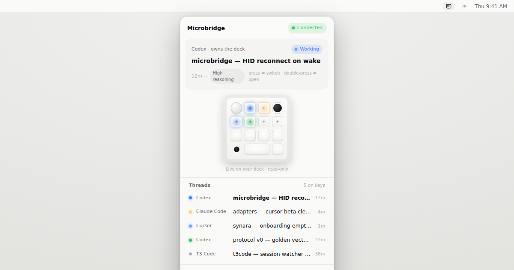
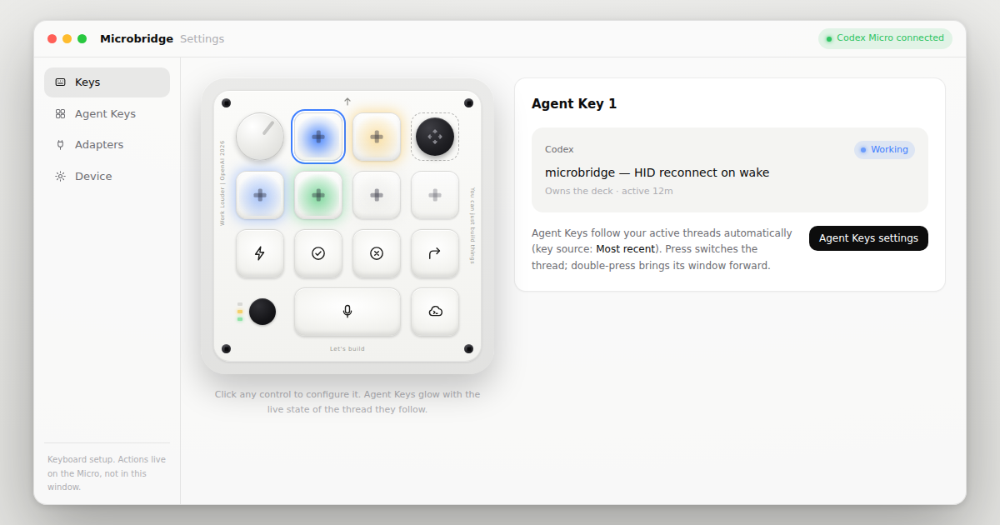
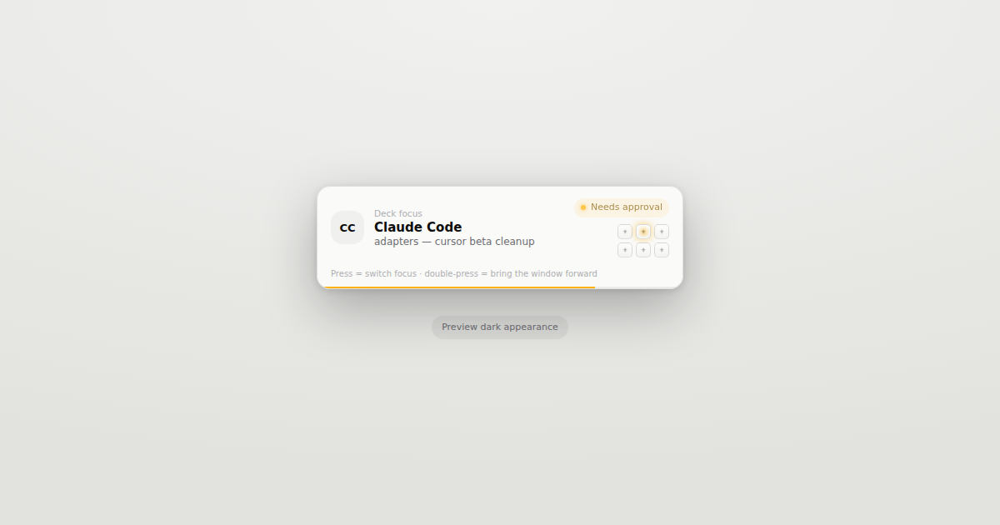

# Microbridge

**An open-source control plane for the Codex Micro — one macropad, every coding agent.**

Microbridge is a tiny local daemon that bridges AI coding agents — ChatGPT, Claude Desktop, Codex CLI, Claude Code, CNVS, Cursor, T3 Code, Synara, Conductor, Factory, OpenCode, and anything else with an integration — to the [Work Louder Codex Micro](https://worklouder.cc/). Per-key RGB mirrors live agent state; keys route only the actions each integration explicitly advertises, so unsupported controls never report false success. No vendor desktop app is required for Microbridge itself.

> **Status: early public alpha (`v0.3.x`).** Menu bar UI, local daemon, in-process ChatGPT/Codex and Claude Desktop/Claude Code attribution, native CNVS control, and signed macOS packages are shipping. Cursor, Factory, OpenCode, and paired T3 Code control are opt-in and capability-gated. **HID protocol (VID/PID, framing, `v.oai.thstatus`) is implemented from ChatGPT’s Work Louder kit**; hardware control stays off until enabled in Device settings (or `MICROBRIDGE_HID_CLAIM=1` is set for diagnostics) while physical validation is completed. See [docs/device-hid.md](docs/device-hid.md).

## Screenshots

Optional companion UI — status and setup only. Agent actions stay on the Micro.

<p align="center">
  
</p>

<p align="center">
  
</p>

<p align="center">
  
</p>

| Surface | File |
|---|---|
| Menu bar popover | [`docs/screenshots/menu-bar-popover.png`](docs/screenshots/menu-bar-popover.png) |
| Settings (device twin) | [`docs/screenshots/settings.png`](docs/screenshots/settings.png) |
| Focus HUD | [`docs/screenshots/focus-hud.png`](docs/screenshots/focus-hud.png) |

Design spec: [docs/design/README.md](docs/design/README.md).

## Why

The Micro's best feature — bidirectional Agent Keys — currently works through exactly one vendor's desktop app. Most of us run agents in more than one place. Microbridge turns the deck into a shared, neutral surface:

- **Integrations publish state.** Each agent session reports `thinking`, `working`, `awaiting_approval`, … as transitions happen.
- **The focus policy decides.** Exactly one session owns the deck at a time; approval requests can preempt. Integrations never touch the device, so two apps can never fight over your keys.
- **The device layer renders.** State becomes LEDs; key presses become routed actions.

## Design principles

1. **Invisible footprint.** Local watchers are event-driven; device input, CNVS's local snapshot API, and an explicitly paired T3 connection use bounded polling and backoff. Idle CPU and RSS remain part of the [footprint budget](docs/architecture.md#footprint-budget).
2. **Local-first and explicit network access.** There is no telemetry or Microbridge cloud relay. The app checks for updates only when requested or enabled, CNVS traffic is restricted to its authenticated loopback endpoint, and the daemon contacts a T3 environment only after the user enables the integration and supplies a one-time pairing link. Factory controls invoke the user-installed `droid` CLI only when a hardware action is requested.
3. **Rust core, any-language integrations.** The always-resident part is a single static Rust binary. First-party integrations compile into it (in-process, ~zero overhead). Optional integrations use official host hooks/APIs or speak [newline-delimited JSON](docs/protocol.md).
4. **The menu bar app is the product UI.** Configure keys, lighting, and integrations there. The daemon keeps the hardware alive underneath; `microbridgectl` is a support/debug escape hatch.

Cursor support is included in the Microbridge app and repository. Enable it
once in **Settings → Integrations**; Microbridge installs its bundled lifecycle
integration into Cursor's supported local-plugin directory. There is no
separate Marketplace download or second product to maintain.

Factory support is also bundled. Enabling it merges Microbridge-owned entries
into Factory's official user hooks without replacing existing hooks; the knob
uses Factory's public JSON-RPC session settings and only cycles levels the
active model advertises. Synara and Conductor sessions are attributed through
the built-in Codex/Claude watchers, so they need no pairing code or extra
background adapter.

OpenCode support is bundled too. Enabling it installs one dependency-free
global plugin through OpenCode's official plugin directory. Lifecycle events
stay in the OpenCode process, and Interrupt uses the documented session API;
there is no polling or additional helper process.

CNVS support is native and automatic: Microbridge reads CNVS's authenticated
loopback control API, represents each agent terminal by its exact canvas and
node identifiers, and routes focus or interrupt back to that target. No pairing
code, private database access, or CNVS modification is required.

## Architecture

```
┌───────────┐ ┌─────────────┐   ┌──────────────────┐
│ ChatGPT / │ │ Claude app /│   │ optional integrations │
│ Codex CLI │ │ Claude Code │   │ OpenCode, Cursor, …   │
└─────┬─────┘ └─────┬───────┘   └────────┬─────────┘
      │  in-process │            NDJSON over unix socket
      ▼             ▼                     ▼
┌──────────────────────────────────────────────────┐
│ microbridged — status bus + focus policy          │  Rust daemon
├──────────────────────────────────────────────────┤
│ device layer (HID) → Codex Micro LEDs / keys      │
└──────────────────────┬───────────────────────────┘
                       │ same socket (status + commands)
             ┌─────────┴─────────┐
             │ menu bar app       │  primary UI (Tauri)
             └───────────────────┘
```

Details in [docs/architecture.md](docs/architecture.md). The wire format is specified in [docs/protocol.md](docs/protocol.md). UI design direction lives in [docs/design](docs/design/README.md).

## Repository layout

```
crates/mb-protocol     wire types (serde) — the protocol's source of truth
crates/mb-device       device abstraction; HID framing + opt-in claim
crates/mb-adapters     first-party Codex CLI + Claude Code watchers
crates/microbridged    the daemon: socket server, registry, focus, key source
crates/microbridgectl  support/debug CLI (`status`)
apps/microbridge-ui    menu bar app — primary UI (MagicPath-faithful)
adapters/              out-of-process community adapters + reference impl
docs/                  protocol, architecture, adapter guide, design, HID notes
```

## Install

Full guide: **[INSTALL.md](INSTALL.md)**. Governance / branch rules: **[docs/governance.md](docs/governance.md)**.

**Direct macOS download:** the signed/notarized DMG is self-contained and
includes the local daemon. Drag Microbridge to Applications and open it; no
separate daemon or Marketplace plugin download is required.

**macOS (recommended — Homebrew installs the menu bar app + daemon):**

```sh
brew tap DevVig/microbridge https://github.com/DevVig/microbridge
brew install microbridge
brew services start microbridge
open ~/Applications/Microbridge.app
# updates: brew update && brew upgrade microbridge
# optional background updates: brew autoupdate start --upgrade --cleanup
```

From source / Linux:

```sh
./scripts/install.sh                 # macOS launchd
./scripts/install-linux-systemd.sh   # Linux systemd --user
```

## Building (dev)

```sh
cargo test          # protocol, focus, key-source, adapters
cargo run -p microbridged
# in another shell:
cargo run -p microbridgectl -- status
node adapters/reference-echo/index.mjs   # walks a fake session through the states
```

Companion UI:

```sh
cd apps/microbridge-ui && npm install && npm run dev
# or: make ui
```

Requires stable Rust (see `rust-toolchain.toml`) and, for Node adapters / UI, Node ≥ 20. macOS and Linux today; Windows (named pipes) is on the roadmap.

## Contributing

Integration PRs are explicitly welcome — that is the point of the project. Start with [docs/adapters.md](docs/adapters.md) and [CONTRIBUTING.md](CONTRIBUTING.md).

## Relationship to Work Louder / OpenAI

Microbridge is an independent community project. It is not affiliated with or endorsed by Work Louder or OpenAI. Driving the Micro's LEDs outside official software relies on best-effort reverse engineering of the device's HID protocol and may lag firmware updates.

## Acknowledgments

Microbridge only exists because the Codex Micro is *open* — and that was a choice, not an accident.

OpenAI is a for-profit company, and it would have been easy to lock the Micro to a single first-party app: a closed protocol, an exclusive USB claim, no way for anyone else to light a key. They did the opposite — they ship the device kit in the open, keep the HID interface **non-exclusive** so third-party software can coexist with the official experience instead of fighting it, and keep giving users a choice (Codex CLI is open source; the models are reachable over documented APIs). None of that was required of them. **Thank you.**

Thanks too to **Work Louder** for designing a genuinely hackable macropad, and to **everyone who writes an integration, files an issue, or plugs in a device and tells us what really happens** — integrations are the point of this project.

Full notes: [ACKNOWLEDGMENTS.md](ACKNOWLEDGMENTS.md).

## License

[MIT](LICENSE) licensed — a permissive, OSI-approved open source license. Contributions are accepted under the same terms (inbound = outbound).
